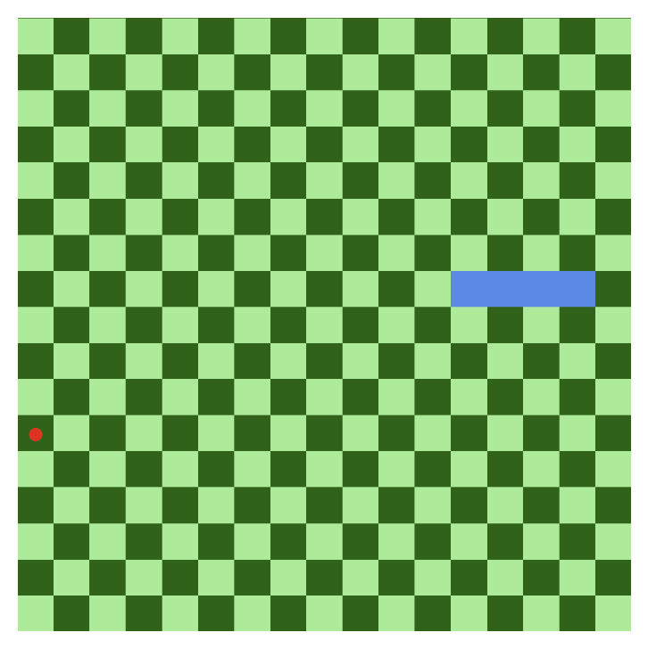
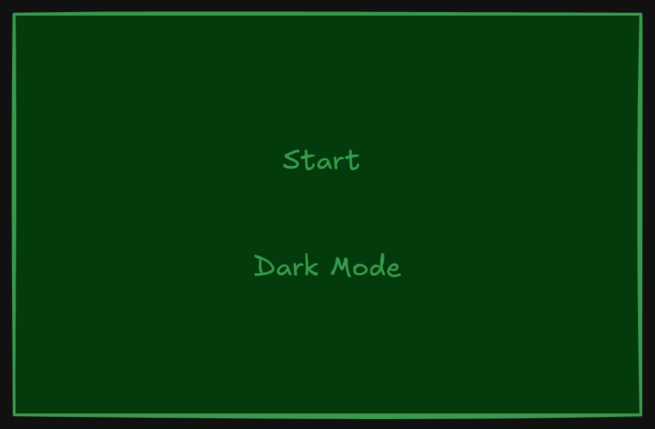

# Snake Game

### Date: [30/06/2025]
### By: [Manaf Hujairi]

[Game Link]( snake_game_project.surge.sh)

### Description
A snake game where the player controls a snake that eats a ball to grow longer and earn points. If the snake's head collides with its own body, the player loses, and the level resets.

### Technologies Used
* JavaScript
* HTML
* CSS

### Pseudocode 
1. Initialize Game Variables:
   - Create game board
   - Define game size
   - Initialize snake, ball, and score variables

2. Create Game Board:
   - Loop through board size
   - Create cells with alternating colors
   - Append cells to the game board

3. Initialize Snake:
   - Create snake head and body segments
   - Set initial position for the snake head

4. Spawn Ball:
   - Randomly generate a position for the ball
   - Ensure the position is empty and not where the snake starts

5. Game Loop:
   - Set up key event listeners for movement (WASD and arrow keys)
   - Store the last direction of movement
   - Continuously update the snake's position based on last direction
   - Check for collisions:
     - If snake head collides with body, call `gameLost()`
     - If snake head reaches ball, increase score and spawn new ball

6. Move Snake:
   - Update head position
   - Move body segments to follow the head

7. Game Lost Function:
   - Reset score and snake position
   - Clear the game board

8. Update Score Display:
   - Show current and best scores

### Screenshots

### Future Updates
- [ ] Add levels with increasing difficulty
- [ ] Implement sound effects
- [ ] Completed UI design

### Credits
none
